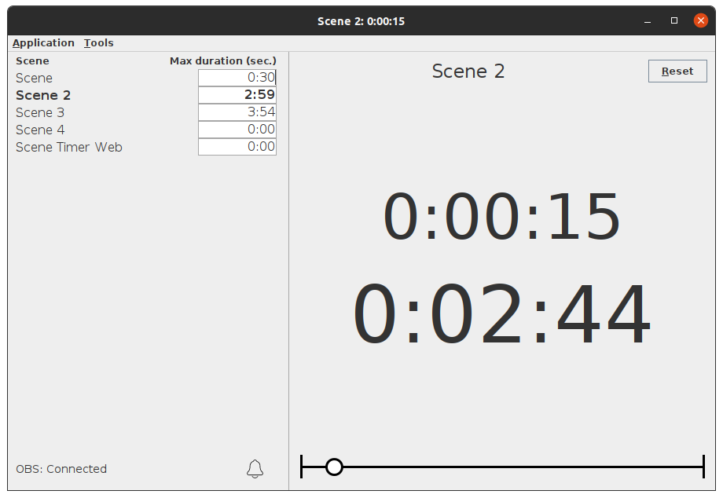

# OBS Scene Timer

_Friendly basic application to keep track of time during your live streams_

_Author: Samuel-Anton Jansen_



_Screenshot with 2 minutes and 44 seconds left on the countdown_

Use cases:

* Playing a media file in OBS but not sure when it ends? This timer will keep track of time!
* Need a timer that starts directly when you switch scenes? This timer will start immediately!
* Want to limit scene durations to a specific time? This timer will help you keep track of time!


## OBS Scene Timer application setup

1. Make sure you have at least Java 8 installed.
1. Make sure your OBS websocket is discoverable by the computer you will run this application on. If it's the same computer, no worries. 
1. **Launch this application** (by running the executable JAR file with Java or running the EXE file).
1. **Edit the settings** if needed. This can be done using the menu Application menu -> Settings or editing the _obs-scene-timer.properties_ file. This file will be created after first launch of the application. Don't run the application when editing this file. Application restart may be needed after changing the application settings.

> OBS 28+ uses a new websocket protocol incompatible with older versions of OBS Scene Timer (< 2.0.0).
> If you're using an older version of OBS (< v28), you have to manually install [obs-websocket](https://github.com/obsproject/obs-websocket/releases) (v4.x.x) next to OBS. You also should use an OBS Scene Timer version **below** 2.x.x (e.g. v1.7.1). 

## How it works

1. The **application will connect** on start up with an (already) running OBS websocket server, as specified in the properties.
1. All available OBS **scenes will be loaded**, and the time limit for each scene can be adjusted. If you are running OBS on the same computer as this application, the application will try to automatically set the maximum time limit for each scene with a video file(s) as source. Note that it might not be able to do this magic for all video sources.
1. When the current **scene changes, the timer will reset** and start counting again from 0 seconds. You can also reset the timer to 0 by clicking the reset button. Also, the list of scenes will be reloaded.
1. When a time limit greater than 0 is set for the current scene, a **countdown** will also be displayed including a track/progress bar.
1. When the **countdown approaches the time limit**, the screen will turn yellow. 
1. When the **countdown has reached 0**, the screen will turn red, and the countdown will continue to count the elapsed time since the time limit has passed (negative number).

Note that time limits are set in seconds. Time limits can be set using the `hh:mm:ss` or `mm:ss` notation. If just an amount of seconds inserted, it will be automatically converted to the `(h):mm:ss` format. For example, inserting 62 will be converted to 1:02. Arrow keys can also be used to increase/decrease time limits.

More info: https://obsproject.com/forum/resources/obs-scene-timer.920/

#### Reset time limit input

If you've adjusted the time limit for a scene for which the time limit was already automatically calculated, your changes will override the automatic calculations. To reset the time limit for the scene (so time limits will be automatically calculated), click the reset button next to the input or enter the value `-1` as time limit. The input will then automatically calculate its default value. 

#### Reloading scenes
If you've added a new media source, please use Application -> Reload scenes to reload the new changes.

##### Valid media sources

This plugin only calculates source lengths for the following OBS sources:

- Media Source
- VLC Video Source

### Features

#### Web client

There's a simple web client available which act as a child node for OBS Scene Timer. This file is downloadable at [Downloads](https://bitbucket.org/sajansen/obs-scene-timer/downloads/).

This client is one single HTML file, which can be opened by most modern web browsers. As a matter of fact, it can also be opened by **OBS Browser source** (for display in multiview) or opened as a **custom OBS panel** (Views / Docks / Custom Browser Docks...). 

> Remember to use the URL (starting with `file:///` following by the file's location). For this, you can open the HTML file in your browser and copy the URL in the address bar.  

##### Configuration

Configuring this client can be done by modifying the source code, or by passing query parameters. The latter are arguments passed inside the URL. The following parameters are available:

- `address` sets the address for the websocket to connect to (the address of the master OBS Scene Timer). Default is "ws://localhost:4050". 
- `scale` scales the text in percentage. Default is `100`, normal scale.
- `alignment` specifies how the two clocks must be aligned: `horizontal` or `vertical` (default). Note that if the page size gets to small, the clocks will auto realign themselves to fit in the page.

The first parameters starts with `?` and the next parameters are stitched together with `&`.

For example:
- `file:///path/to/file/obs-scene-timer-client.html?scale=50` uses the default address but scales the text to `50`%.
- `file:///path/to/file/obs-scene-timer-client.html?address=ws://localhost:4050&scale=150` lets this client connect to `localhost:4050` (which is also the default value) and scales the text to `150`%.
- `file:///path/to/file/obs-scene-timer-client.html?alignment=horizontal&scale=50` the clocks will be displayed next to each other and are scaled to `50`%.

Setting the address/scale by query parameter (URL) overrules the values below set by script.

I found that using a scale of 40% works perfectly fine for using the client as OBS dock, and 100% (and 1080 x 1920 px) for a OBS Browser source.

Make sure "Remote Sync server" is running in OBS Scene Timer! See below.

#### Network Scanner

When using OBS Scene Timer on another computer as OBS projector itself, it can be quite a struggle to figure out the correct IP address of the OBS projector computer. Head to the menu Tools -> Network Scanner to let OBS Scene Timer scan for any possible OBS projector hosts on your local network. This scanning is done by querying the default OBS websocket port 4444 on all possible IP address available on your local network(s). 

The default timeout used for the scanning progress is 200 ms. This value can be increased in the Network Scanner window if no OBS websockets are detected. Users of slow local networks may need to increase this value. 

#### Remote sync

You can run multiple instances of OBS Scene Timer on different computers in a master/slave configuration. To set this up, you need to run 1 instance of OBS Scene Timer as the server. All the other instances should be running as client. In the settings you can configure the host address of the server instance. The default port is 4050, but can be configured in the settings of the server instance.

To run an instance as server or client, in the menu go to Tools -> Remote Sync and start the server or client. You can also stop the instance running as a server/client. 

The clients will purely rely on the information they get from the server. The server will send all clients a message when the timer changes (every second). This message includes the elapsed time, remaining time, current scene, and even tell if the client must show the time limit approaching/exceeded warnings. 
Due to network delays, the clients may be slightly lagging behind. 

When a client instance is started while previously connected to OBS itself, that connection will be closed.

##### API

###### Connection

A client can connect to the Remote Sync websocket connection on `ws://<websocketAddress>:<websocketPort>/`, for example: `ws://localhost:4050/`. 

###### Messages

Messages are sent in JSON format. Currently, only one type of message is sent: 

**TimerMessage**

| Field | Type | Description |
| --- | --- | --- | 
| `sceneName` | string | Name of the current active scene. |
| `elapsedTime` | string | Formatted timestamp of the elapsed time of the current active scene. |
| `elapsedTimeRaw` | long | Number of elapsed seconds of the current active scene. |
| `timerState` | TimerState | The current state of the timer. See #TimerState for more info. |
| `isTimed` | boolean | True if the current active scene has a configured time limit. |
| `remainingTime` | string | Formatted timestamp of the remaining time (if applicable) of the current active scene. |
| `remainingTimeRaw` | long | Number of remaining seconds (if applicable) of the current active scene. |
| `maximumTime` | long | Total number of seconds of the scene, a.k.a. scene time limit. |
| `timestamp` | datetime | Timestamp of when this message was sent. |
| `messageType` | string | Specifies the type of the message sent. |

Example message: 

```json
{
  "sceneName": "Scene 1",
  "elapsedTime": "00:00:10",
  "elapsedTimeRaw": 10,
  "timerState": "NEUTRAL",
  "isTimed": true,
  "remainingTime": "00:00:20",
  "remainingTimeRaw": 20,
  "maximumTime": 30,
  "timestamp": "2020-06-04T16:49:58.670Z",
  "messageType": "TimerMessage"
}
```

**TimerState**

TimerState is an enum with any of the following values:

| Value | Description |
| --- | --- |
| NEUTRAL | Timer is just minding it's own business. |
| APPROACHING | Timer is approaching the configured time limit. (Approaching rules are specified in the settings.) |
| EXCEEDED | Timer has exceeded the configured time limit. |

#### Grouping

Scenes can be grouped together. The result of this is that the timer doesn't reset when the new scene from a scene change is in the same group as the previous scene. This may be useful in scenarios where you want the timer to continue counting when switching between multiple camera-angle-scenes, for example.

Scenes can be grouped in numerous groups using the Group Settings window under Tools -> Group Settings. Or by pressing `CTRL + ALT + G`. Add a scene to a group by checking the checkbox in the desired group column and on the same row as the desired scene. (Assigning only one scene to a group is useless.)

Scenes which are assigned to a group, will appear in _Italic_ font (in the list). Also, when hovering above their label, a tool tip text will be shown containing the groups the scene is assigned to.

#### Themes

An application theme can be set in Application menu -> Settings. Currently, only Light theme is available and Dark theme is experimental. You can develop your own theme by extending the BaseTheme class and creating a pull request to the `develop` branch. 

#### Notifications

When an error or something else interesting occurs, a notification of this event will be available. Click on the "Notifications" button to show all these notifications. The user will be alerted for new notifications by the number of new notifications being displayed on this button. 

#### Scene Timestamp logging

A built in logging mechanism can be enabled (see Properties chapter) to log the timestamp and scene name every time the active scene changes. The output is a `;` separated .csv file which name starts with `sceneLogger_`. When the application starts, it will create a new file in the same directory with a timestamp, e.g.: `sceneLogger_2020-04-19_11-27-41.csv`.

#### Auto reconnect

When connection to OBS is lost, OBS Scene Timer will continue keeping track of time, no matter what. Even after connection with OBS is re-established, the time for the same scene is still correct. Of course, the application cannot detect any scene changes while disconnected with OBS. 

OBS Scene Timer will not attempt to reconnect immediately, but during a continuous interval of 3 seconds (as specified in the properties).

#### Hot keys

List of hotkeys:

| Key | Action |
| --- | ----- |
| `ALT + R` | Reset timer to 00:00:00 |
| `F11` | Toggle fullscreen |
| `ESC` | Close popup |
| `CTRL + W` | Close popup |
| `CTRL + Q` | Quit application |

#### Logging

Application logging is done to the console and to a file. Location of this file is displayed in the Info window. By default, the log level is INFO. For debug logging, pass the `-v` argument when running the application, like so: 

```bash
java -jar obs-scene-timer.jar -v
```

### Properties

In the same directory as the _.jar_ file, the _obs-scene-timer.properties_ can be found. Every time the application runs, it will load its configuration from this file. You can edit this file in your favorite editor. By editing the properties in the GUI via Application menu -> Settings, the new values will also be saved to this _obs-scene-timer.properties_ file. By deleting this file, all properties are reset to default. 

Don't run the application while editing the _obs-scene-timer.properties_ file (and before saving your changes), as your changes won't be loaded until the next launch of the application. Also, the application will overwrite your changes if it is still running. If you need to edit the properties during application execution, use the GUI: Application menu -> Settings. Note that some settings still require application restart.

> Note: if you've been using OBS Scene Timer version 1.5.0 and/or previous versions, the properties file will be named _user.properties_. 

#### Explanation

Most of the properties are explained here:

_Connection settings_

* `obsAddress` (string) (default: `ws://localhost:4444`): holds the full address of the OBS websocket server. This server can be on any computer in the same network of even over internet, as long as it can be reached by the obs-scene-timer application.
* `obsPassword` (string) (default: `<empty>`): the password needed to connect to the OBS websocket. Please note that this **password is stored as plain text** in the properties file and therefore is readable by anyone with access to this file.
* `obsReconnectionTimeout` (milliseconds) (default: `3000`): if connection with OBS failed or is lost, OBS Scene Timer will try to reconnect to OBS after this time in milliseconds.
* `autoCalculateSceneLimitsBySources` (boolean) (default: `true`): if enabled and OBS Scene Timer is running on the same computer as OBS, OBS Scene Timer will load all video sources to automatically determine each scene max duration.

_GUI settings_

* `mainWindowTitle` (string) (default: `{sceneName}: {timerElapsed}`): On each timer update (every second) the window title of the application will be updated with the title specified in this variable. Plain text can be mixed with variables like `{sceneName}`, `{timerElapsed}`, `{timerRemaining}`, and `{sceneLimit}`. For example: `Timer Application - {sceneName} - {timerElapsed} / {timerRemaining}` will result in a window title like _"Timer Application - Intro scene - 0:00:15 / 0:01:29"_. Note that when no connection is established with OBS, the title will be _"OBS Scene Timer"_, until the connection has been established.
 
_Timer settings_

* `timerStartDelay` (milliseconds) (default: `300`): start the timer with this delay. Decrease this value if the timer value seems to be lagging behind the real scene duration. This is caused by (network) connection delays but mainly by the OBS scene transition delay. 

* `smallMinLimitForLimitApproaching` (seconds) (default `20`): don't show time-limit-approaching warnings for time limits smaller than this value.
* `smallTimeDifferenceForLimitApproaching` (seconds) (default `10`): show the time-limit-approaching warning this amount of seconds before reaching the time limit.
* `largeMinLimitForLimitApproaching` (seconds) (default `60`): use `largeTimeDifferenceForLimitApproaching` value for time-limit-approaching warning for time limits greater or equal to this value.  
* `largeTimeDifferenceForLimitApproaching` (seconds) (default `30`): show the time-limit-approaching warning this amount of seconds before reaching the time limit. Only for scene's with a time limit greater or equal than `largeTimeDifferenceForLimitApproaching` value.
* `timerFlashForRemainingTimeLessThan` (seconds) (default `10`): when the remaining time becomes equal or less than this value, the timer screen starts flashing red.
* `timerFlashDurationInMilliSeconds` (milliseconds) (default `100`): the duration of the red timer flash before setting the screen back to yellow.
* `timerCountUpFontSize` (number) (default `80`): the font size of the main timer (which is always visible).
* `timerCountDownFontSize` (number) (default `100`): the font size of the countdown timer (which is visible when a time limit is set for the current scene).

_Other settings_

* `enableSceneTimestampLogger` (boolean) (default: `false`): enable the logging of every scene change to a .csv file. This file will be generated in the same folder as the application. Might be handy for diagnoses afterwards. 
* `enableApplicationLoggingToFile` (boolean) (default: `true` since v1.4.1): Write application logging to a file. Location of this logfile is shown in the Information screen. Submit this file when reporting issues/bugs.
* `maxLogFileSize` (number in bytes) (default: `1024*1024` = 1 MB): when the logg file exceeds this size, a new one will be created and the old one will be renamed with `*.1.*`.

_Remote sync_

* `remoteSyncServerEnabled` (boolean) (default: `false`): Whether this instance should run as a remote sync server.
* `remoteSyncServerPort` (number) (default: `4050`): The port the remote sync server should run on.
* `remoteSyncClientEnabled` (boolean) (default: `false`): Whether this instance should run as a remote sync client.
* `remoteSyncClientAddress` (string) (default: `obsAddres:4050`): The remote sync server address which the client should connect to. 
* `remoteSyncClientReconnectionTimeout` (milliseconds) (default: `3000`): if connection with the remote sync server failed or is lost, OBS Scene Timer will try to reconnect to the server after this time in milliseconds.

---

### Hidden features

Use the following command line arguments for:

* `-v`: Enable verbose logging.
* `--offline`: Start OBS Scene Timer without connecting to OBS.
* `--clear-update-history`: Clear the update history in order to force display new updates.

## Contribution

Feel free to contribute by opening a pull request to `develop` branch or leaving a comment somewhere.

Please try to add/edit tests for the code you've worked on. Also build the application with `mvn clean install` and run the compiled jar with `java -jar obs-scene-timer-X.X.X-SNAPSHOT.jar`.

## Donation

If you don't want to code, but still want to contribute, consider [buying me a coffee](https://www.buymeacoffee.com/sajansen) so I can afford to spend more time working on these projects :)
