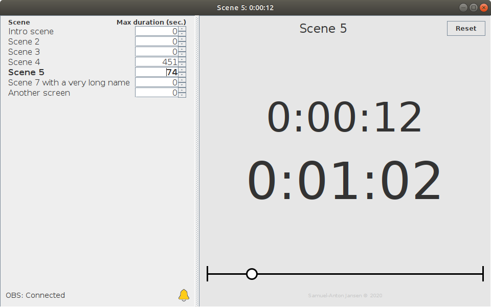

# OBS Scene Timer

_Friendly application to keep track of time during your live streams_

_Author: Samuel-Anton Jansen_

_Screenshot with 28 seconds left on the countdown_

Use cases:

* Playing a media file in OBS but not sure when it ends? This timer will keep track of time!
* Need a timer that starts directly when you switch scenes? This timer will start immediately!
* Want to limit scene durations to a specific time? This timer will help you keep track of time!

## Build

You can download all versions from [BitBucket](https://bitbucket.org/sajansen/obs-scene-timer/downloads/), or build this application yourself using Maven.

## Setup

1. Download and **install [obs-websocket](https://github.com/Palakis/obs-websocket)** for your OBS application.
1. Make sure your OBS websocket is discoverable by the computer you will run this application on. If it's the same computer, no worries. 
1. **Launch this application** (by running the executable JAR file) with Java and enjoy.
1. **Edit the settings** in the _user.properties_ file if needed. This file will be created after first launch of the application. Don't run the application when editing these settings.

## How it works

1. The **application will connect** on startup with an already running OBS websocket server, as specified in the properties.
1. All available OBS **scenes will be loaded**, and the time limit for each scene can be adjusted. If you are running OBS on the same computer as this application, the application will try to automatically set the maximum time limit for each scene with a video file(s) as source. Note that it might not be able to do this magic for all video sources.
1. When the current **scene changes, the timer will reset** and start counting again from 0 seconds. You can also reset the timer to 0 by clicking the reset button. Also, the list of scenes will be reloaded.
1. When a time limit greater than 0 is set for the current scene, a **countdown** will also be displayed including a track/progress bar.
1. When the **countdown approaches the time limit**, the screen will turn yellow. 
1. When the **countdown has reached 0**, the screen will turn red, and the countdown will continue to count the elapsed time since the time limit has passed (negative number).

More info: https://obsproject.com/forum/resources/obs-scene-timer.920/

#### Notifications

When an error or something else interesting occurs, a notification of this event will be available. Click on the "Notifications" button to show all these notifications. The user will be alerted for new notifications by the number of new notifications being displayed on this button. 

#### Scene Timestamp logging

A built in logging mechanism can be enabled (see Properties chapter) to log the timestamp and scene name every time the active scene changes. The output is a `;` separated .csv file which name starts with `sceneLogger_`. When the application starts, it will create a new file in the same directory with a timestamp, e.g.: `sceneLogger_2020-04-19_11-27-41.csv`.

#### Auto reconnect

When connection to OBS is lost, OBS Scene Timer will continue keeping track of time, no matter what. Even after connection with OBS is re-established, the time for the same scene is still correct. Of course, the application cannot detect any scene changes while disconnected with OBS. 

OBS Scene Timer will not attempt to reconnect immediately, but during a continuous interval of 3 seconds (as specified in the properties).

### Properties

In the same directory as the _.jar_ file, the _user.properties_ can be found. Every time the application runs, it will load its configuration from this file. Edit this file in your favorite editor. 

Don't run the application while editing these settings (and before saving the settings), as your changes won't be loaded until the next launch of the application. Also, the application will overwrite your changes if it is still running. 

#### Explanation

_Connection settings_

* `obsAddress` (string) (default: `ws://localhost:4444`): holds the full address of the OBS websocket server. This server can be on any computer in the same network of even over internet, as long as it can be reached by the obs-scene-timer application.
* `obsPassword` (string) (default: `<empty>`): the password needed to connect to the OBS websocket. **Note**: this isn't yet implemented, as we wait for the next release of `obs-websocket-java`.
* `obsReconnectionTimeout` (milliseconds) (default: `3000`): if connection with OBS failed or is lost, OBS Scene Timer will try to reconnect to OBS after this time in milliseconds.

_Application color settings_

* `timerBackgroundColor` (rgb) (default: `192,192,192`): a RGB color, separated by comma's, which will be used as the default background color for the timer.
* `approachingLimitColor` (rgb) (default: `255,200,0`): a RGB color, separated by comma's, which will be used as the background color for the timer when it warns that the time limit is being approached (see `smallTimeDifferenceForLimitApproaching` and `largeTimeDifferenceForLimitApproaching`).
* `exceededLimitColor` (rgb) (default: `255,0,0`): a RGB color, separated by comma's, which will be used as the background color for the timer when it warns that the time limit has been reached.

 _Timer settings_
 
 * `smallMinLimitForLimitApproaching` (seconds) (default `20`): don't show time-limit-approaching warnings for time limits smaller than this value.
 * `smallTimeDifferenceForLimitApproaching` (seconds) (default `10`): show the time-limit-approaching warning this amount of seconds before reaching the time limit.
 * `largeMinLimitForLimitApproaching` (seconds) (default `60`): use `largeTimeDifferenceForLimitApproaching` value for time-limit-approaching warning for time limits greater or equal to this value.  
 * `largeTimeDifferenceForLimitApproaching` (seconds) (default `30`): show the time-limit-approaching warning this amount of seconds before reaching the time limit. Only for scene's with a time limit greater or equal than `largeTimeDifferenceForLimitApproaching` value.
 
 _Other settings_
 
 * `enableSceneTimestampLogger` (boolean) (default: `false`): enable the logging of every scene change to a .csv file. This file will be generated in the same folder as the application. Might be handy for diagnoses afterwards. 
 
 
 ---
 
 Feel free to contribute by opening a pull request or leaving a comment somewhere.